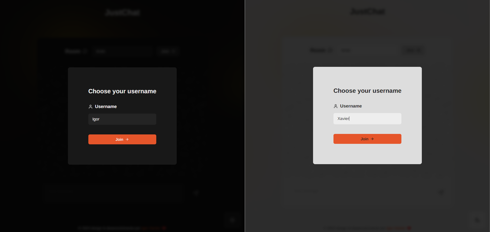
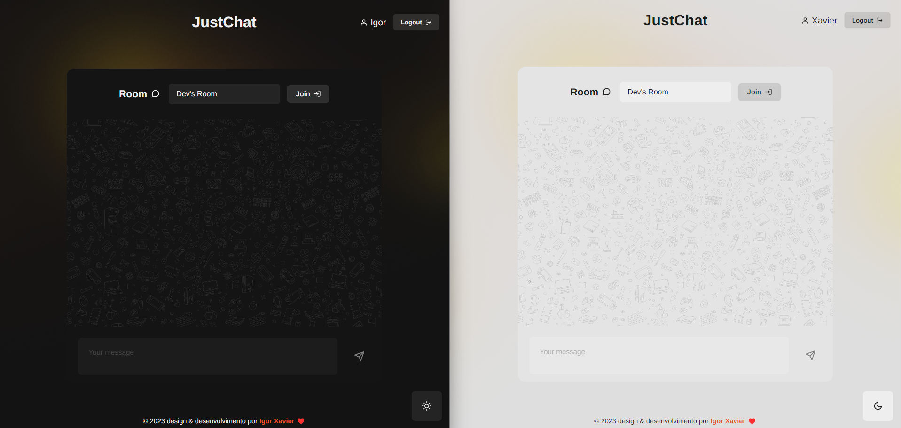
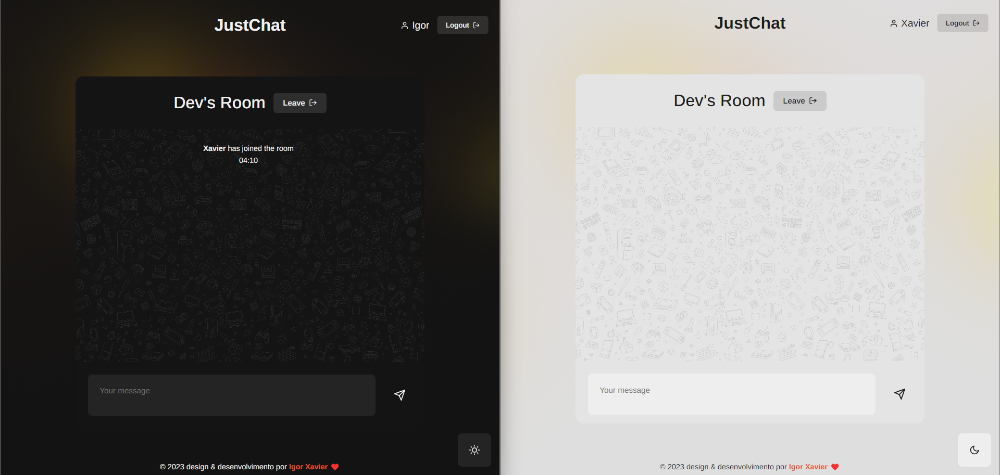
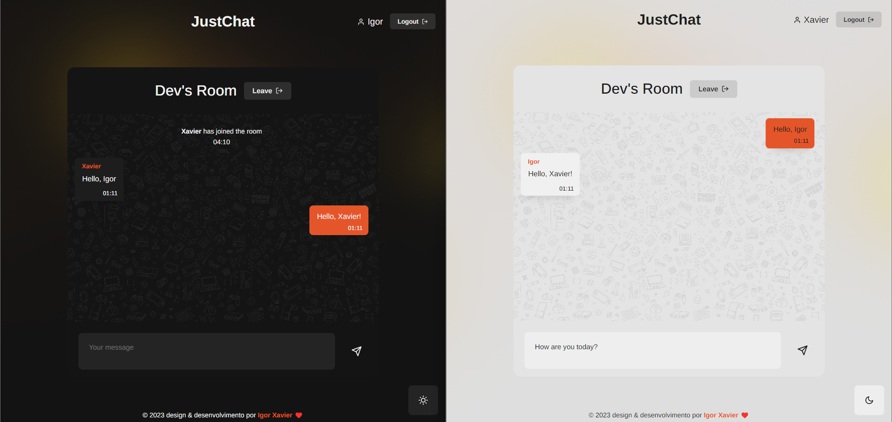
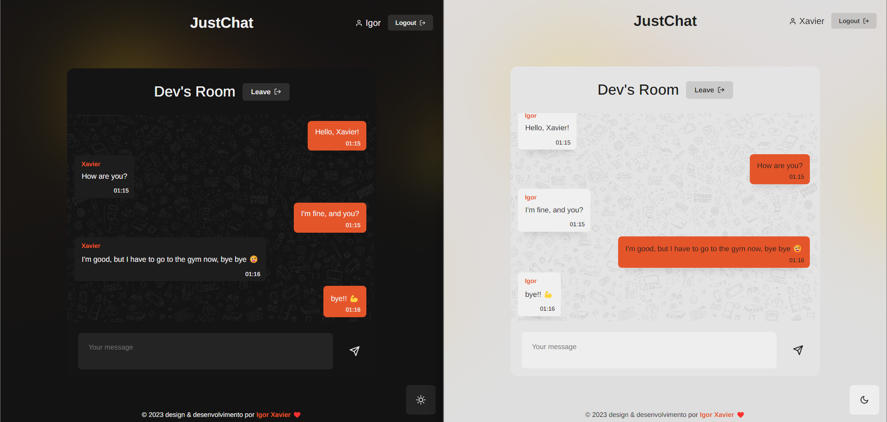
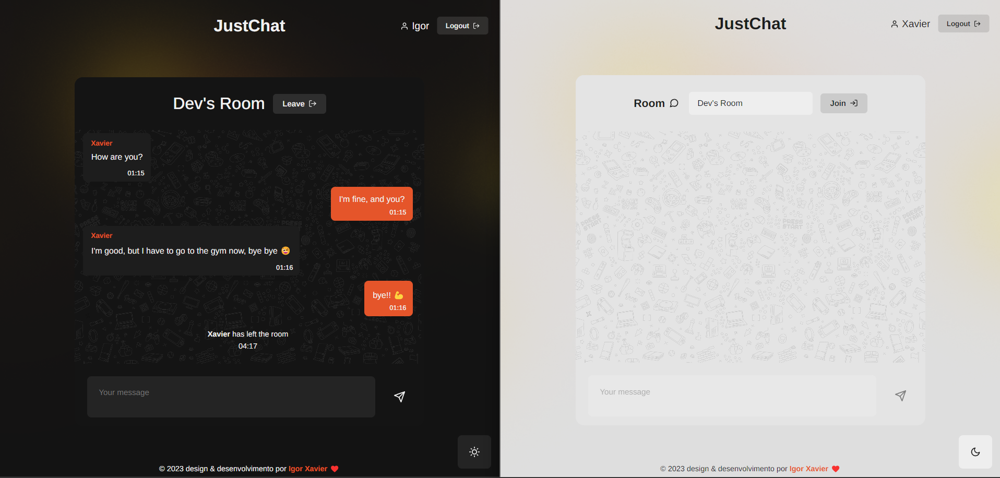

# JustChat

<a href="https://react-chat-socket-io.vercel.app/">production version</a>

> A chat application using react ⚛️ and socket.io on client &amp; server side


## ⚒️ Technologies

- React ⚛️
- Socket.io ⚡
- Node.js 🌐

## 🖥️ Installation & Set Up

1. Install dependencies in *client* and run

   ```sh
   cd client
   yarn (npm i)
   yarn start (npm start)
   ```

2. Install dependencies in *server* and run

   ```sh
   cd server
   yarn (npm i)
   yarn start (npm start)
   ```

3. How to access

   ```sh
   server will be running in 4000 port
   client in 3000 port
   ```

4. There you go!

   ```sh
   put the client URL in your browser (http://localhost:3000)
   ```

## 📷 Screenshots

Initial page, set your username to be show to others



Choose a room to enter typing it's name (all rooms are valid)


Join the room!


Start chatting



Then leave (whenever you want)


## 😊 Follow me
- <a href="https://www.instagram.com/igorxavi_/">instagram</a>
- <a href="https://www.linkedin.com/in/igorxavierdasilva/">linkedin</a>
- <a href="https://github.com/igorxaviers">github</a>
